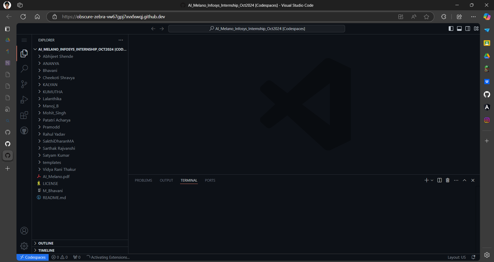
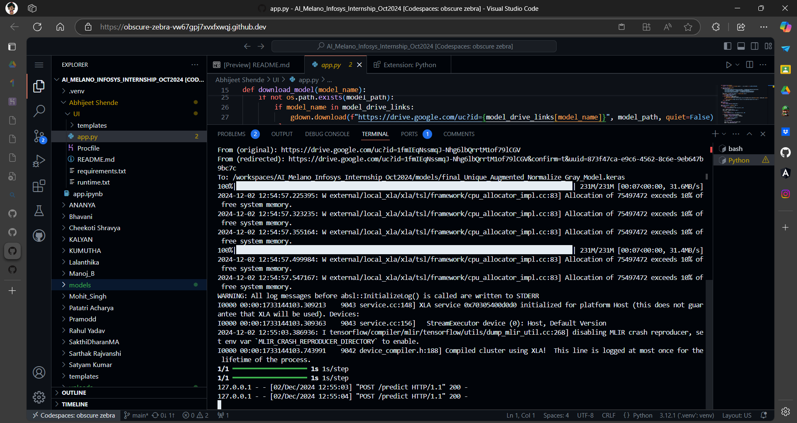

## How to Run the Project Online

1. **Open the Project Repository on GitHub**
   - Click on `<> Code`
   

2. **Create a Codespace**
   - Navigate to `Codespaces` and click on `+` to create a codespace on the main branch.
   

3. **Open in VS Code**
   - This will open a new page in VS Code.
   

4. **Navigate to the Directory**
   - Open the `app.py` file as shown in the image below.
   

5. **Install Python Extension**
   - A popup will appear to install the Python extension. Click on `Install`.
   

6. **Run the Application**
   - Once the installation is complete, a new `▶️` button will appear in the top right corner. Click on it.
   

7. **Create a Virtual Environment**
   - A notification will appear to create a virtual environment. Click on `Create`.
   

8. **Select Virtual Environment**
   - Choose `Venv`.
   

9. **Select Python Version**
   - Choose `Python 3.12.1`.
   

10. **Select User**
    - Select `Abhijeet Shende` and click `OK`.
    

11. **Virtual Environment Creation**
    - The virtual environment will start creating.
    

12. **Open in Browser**
    - Once done, a notification will appear. Click on `Open in Browser` (or click on the run button `▶️` again).
    

13. **Start the App**
    - This will start the app.
    

14. **App Interface**
    - Here is the app interface:
    
    

15. **Close the App**
    - To close the app, go to the terminal and press `Ctrl + C`.
    